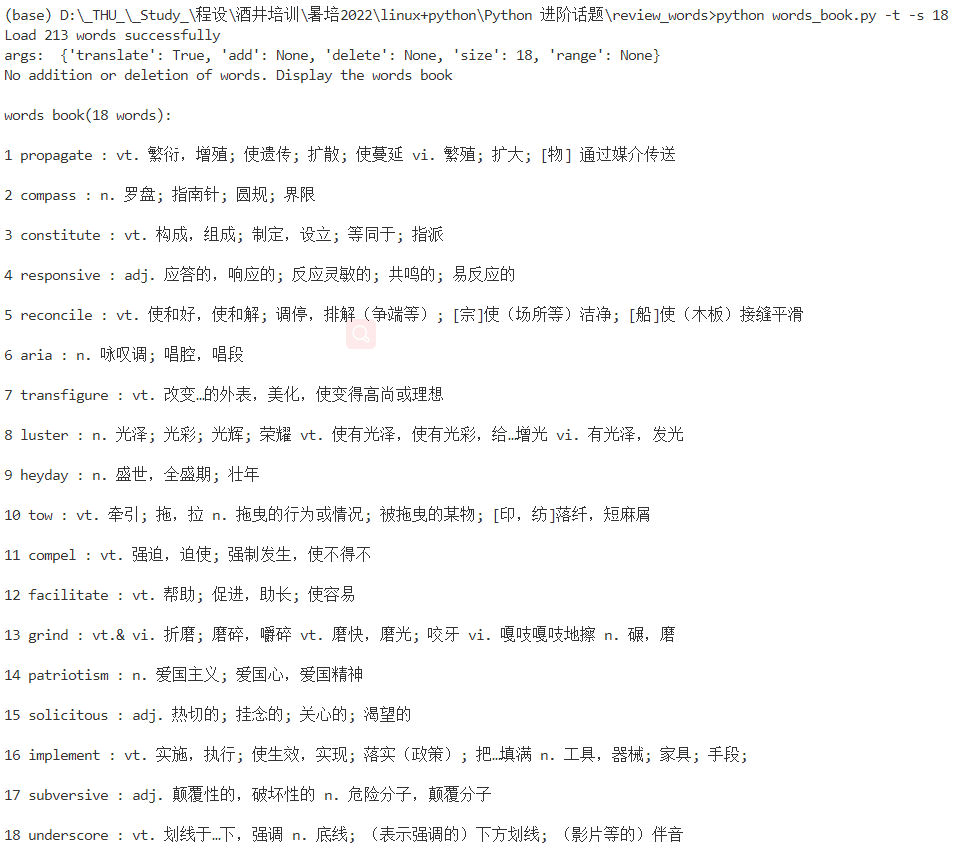
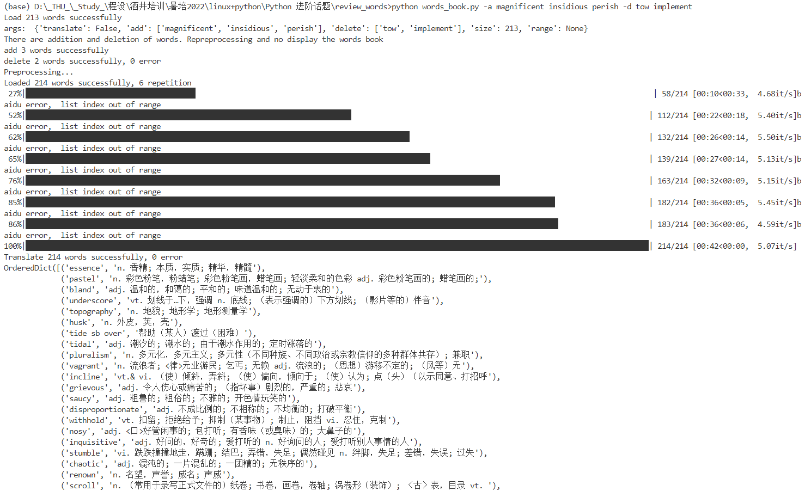

# Words_review_book

### a book to review English words(SAST 2022)

本项目是2022酒井暑培的python小作业，作业要求见hw.md文件。

参数的使用方式如下：

```
-t 用于选择是否需要单词的翻译（加上-t表示需要，不加表示不需要）
-a 用于添加单词到单词本内，其后可跟任意个空格隔开的单词
-d 用于删除单词本内的单词，其后可跟任意个空格隔开的单词
-s 表示用户希望显示单词的个数
-r 表示用户希望显示单词本内单词的范围
```

* 为避免矛盾，-r和-s参数不能同时出现（会报错），若都不出现表示显示全部单词
* 无论选择单词个数还是范围，最终显示的结果均会经过随机排序

* 若有-a或-d参数，则只会进行单词的增删和预处理（指更新翻译结果），不显示单词本

如 `python words_book.py -t -r 20 200 `表示显示单词本第20到第200个单词且带中文翻译；`python words_book.py -a school tsinghua -d peiking ` 表示增删单词并更新翻译结果

#### 问题
此处的-a和-d后面加的参数都只能是单个单词而不能是词组（词组中间有空格会被识别成多个单词）。解决这个问题可以把词组中间的空格变成_，在add_delete_word.py中添加额外处理即可。该问题暂未在代码中解决。

### 项目环境

见  `./requirements.yaml` (由 `conda env export > environment.yaml`自动生成，可能较臃肿)，运行 ` conda env create -n <env_name> -f ./requirements.yaml`建立新的conda环境，然后按上面的方式输入代码运行。

### 运行效果



### 参考

[demo by zhanchenyang20](https://github.com/zhaochenyang20/TOFEL_words_reviewer)
